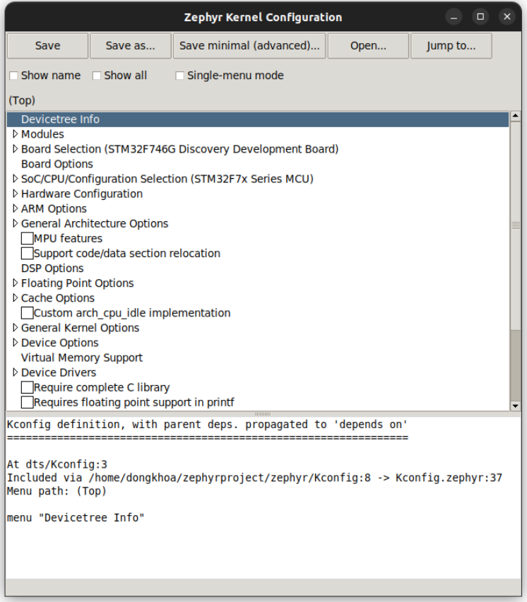
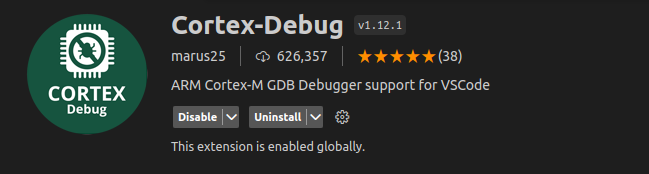

MỘT SỐ HƯỞNG DẪN VỀ ZEPHYR PROJECT - ZEPHYR OS
===========================================================================

.. contents::
    :local:
    :depth: 2

---------------------------------------------------------------------------
Yêu cầu về phần cứng
---------------------------------------------------------------------------

-   Ubuntu version từ 20 trở lên (khuyến nghị cài dual boot nếu sài máy áo có thể bị lỗi khi flash vào chip).
-   Ổ cứng cấp phát cho ubuntu trên 20GB.
-   Board sử dụng là STM32F746G_Disco.

---------------------------------------------------------------------------
Các bước cài đặt
---------------------------------------------------------------------------

.. note::
    Lưu ý trước khi cài đặt là đảm bảo mạng kết nối luôn ổn định và máy tính không được mất điện giữa lúc cài 
    (đây là ubuntu nên cái gì cũng có thể đi luôn cái ubuntu)

Bước 1: Cài đặt các tool phụ thuộc (CMake, Python, Devicetree compiler)
---------------------------------------------------------------------------

- Sử dụng ``apt`` để cài đặt các tool:

.. code-block:: bash

    sudo apt install --no-install-recommends git cmake ninja-build gperf \
    ccache dfu-util device-tree-compiler wget \
    python3-dev python3-pip python3-setuptools python3-tk python3-wheel xz-utils file \
    make gcc gcc-multilib g++-multilib libsdl2-dev libmagic1

- Check lại xem đã cài được chưa:

.. code-block:: bash

    cmake --version
    python3 --version
    dtc --version

- **Kết quả:**

.. image:: ../img/img_1.png
   :alt: alternate text

.. _activate_virtual_environment:

Bước 2: Cài môi trường ảo và zephyr project
---------------------------------------------------------------------------

- Sử dụng ``apt`` để cài gói ``venv`` của Python:

.. code-block:: bash

    sudo apt install python3-venv

- Tạo môi trường ảo: 

.. code-block:: bash

    python3 -m venv ~/zephyrproject/.venv

- Activate môi trường ảo:

.. code-block:: bash

    source ~/zephyrproject/.venv/bin/activate

.. note::
    Lưu ý: mỗi khi muốn build hoặc flash zephyr project đều phải sử dụng lệnh này.

- Cài đặt ``west``:

.. code-block:: bash
    
    pip install west

- Get source code của Zephyr:

.. code-block:: bash
    
    west init ~/zephyrproject
    cd ~/zephyrproject
    west update

.. note::
    Lưu ý: đây là nguồn để học về các hàm sử dụng trong zephyr rất hiệu quả nên hãy cố gắng khai thác hết mức có thể.

- Export Zephyr CMake package:

.. code-block:: bash
    
    west zephyr-export

- Cài đặt các requirement:

.. code-block:: bash
    
    pip install -r ~/zephyrproject/zephyr/scripts/requirements.txt

Bước 3: Cài Zephyr SDK
---------------------------------------------------------------------------

- Tải và verify Zephyr SDK:

.. code-block:: bash

    cd ~
    wget https://github.com/zephyrproject-rtos/sdk-ng/releases/download/v0.16.4/zephyr-sdk-0.16.4_linux-x86_64.tar.xz
    wget -O - https://github.com/zephyrproject-rtos/sdk-ng/releases/download/v0.16.4/sha256.sum | shasum --check --ignore-missing

- Giải nén tệp vừa tải:

.. code-block:: bash

    tar xvf zephyr-sdk-0.16.4_linux-x86_64.tar.xz

- Cài đặt Zephyr SDK:

.. code-block:: bash

    cd zephyr-sdk-0.16.4
    ./setup.sh

Bước 4: Build một project sample
---------------------------------------------------------------------------

- Chọn một project sample:

.. code-block:: bash

    cd ~
    cd ./zephyrproject/zephyr/samples/basic/blinky

- Chọn Board để build:

**Các board mà zephyr hổ trở:** `Supported Boards <https://docs.zephyrproject.org/latest/boards/index.html#boards>`_.

.. code-block:: bash

    west build -p always -b <your-board-name>

**Nếu bạn thêm lệnh** ``set(BOARD <your-board-name>)`` **trong file CMakeLists.txt trong project thì chỉ cần ghi:** ``west build``

.. image:: ../img/img_2.png
   :alt: alternate text

**Nếu như bạn gặp lỗi:**

.. image:: ../img/img_3.png
   :alt: alternate text

**Hãy truy cập vào thư mục đó rồi chỉnh sửa file main.c như sau:** *(Lưu ý sau khi thay đổi file main.c
hãy xóa thư mục build trong project đó hãy build lại)*

.. code-block:: c

    #include <stdio.h>
    #include <zephyr/kernel.h>
    #include <zephyr/drivers/gpio.h>

    /* 1000 msec = 1 sec */
    #define SLEEP_TIME_MS   1000

    /* The devicetree node identifier for the "led0" alias. */
    #define LED0_NODE DT_ALIAS(led0)
    static const struct gpio_dt_spec led = GPIO_DT_SPEC_GET(LED0_NODE, gpios);

    int main(void)
    {
        int ret;
        bool led_state = true;

        if (!gpio_is_ready_dt(&led)) {
            return 0;
        }

        ret = gpio_pin_configure_dt(&led, GPIO_OUTPUT_ACTIVE);
        if (ret < 0) {
            return 0;
        }

        while (1) {
            ret = gpio_pin_toggle_dt(&led);
            if (ret < 0) {
                return 0;
            }

            led_state = !led_state;
            printf("LED state: %s\n", led_state ? "ON" : "OFF");
            k_msleep(SLEEP_TIME_MS);
        }
        return 0;
    }

.. image:: ../img/img_4.png
   :alt: alternate text

---------------------------------------------------------------------------
Cấu trúc về Zephyr Project
---------------------------------------------------------------------------

Bước 1: Khởi tạo workspace folder (*my-workspace*)
---------------------------------------------------------------------------

.. note::
    
    Trước khi khởi tạo workspace folder hãy active virtual environment (:ref:`activate_virtual_environment`).
    
    Dung lượng nơi lưu trử  > 1GB.

-   Chạy command như sau:

.. code-block:: bash

    # initialize my-workspace for the example-application (main branch)
    west init -m https://github.com/zephyrproject-rtos/example-application --mr main my-workspace

Bước 2: Chỉnh sửa lại file set up thư viện cho project
---------------------------------------------------------------------------

-   Mở thư mục file ``my-workspace/west.yml``. Mặc định nó sẽ như sau:

.. code-block:: yaml

    # Copyright (c) 2021 Nordic Semiconductor ASA
    # SPDX-License-Identifier: Apache-2.0

    manifest:
    self:
        west-commands: scripts/west-commands.yml

    remotes:
        - name: zephyrproject-rtos
        url-base: https://github.com/zephyrproject-rtos

    projects:
        - name: zephyr
        remote: zephyrproject-rtos
        revision: main
        import:
            # By using name-allowlist we can clone only the modules that are
            # strictly needed by the application.
            name-allowlist:
            - cmsis      # required by the ARM port
            - hal_nordic # required by the custom_plank board (Nordic based)
            - hal_stm32  # required by the nucleo_f302r8 board (STM32 based)

-   Do ở đẩy sử dụng board STM32F746G_Disco, Nên chỉ cần ``cmsis`` và ``hal_stm32`` => xóa ``hal_nordic`` (*dùng cho board nrf*).

Bước 3: Update thư viện cho project và build, flash trong project
---------------------------------------------------------------------------

-   Chạy command sau:

.. code-block:: bash
    
    # update Zephyr modules
    cd my-workspace
    west update

-   Vào project có trong workspace:

.. code-block:: bash
    
    cd ./example-project

-   Build Project:

.. code-block:: bash
    
    west build -b $BOARD app

-   Flash vào chip:

.. code-block:: bash
    
    west flash

Bước 3: Giải thích các folder chính có trong project
---------------------------------------------------------------------------

*   ``boards``: Chứa các file config dành cho board mà zephyr không hổ trợ sẳn.
*   ``drivers``: Viết thư viện dành cho các driver chứa có thư viện như button...
*   ``dts``: Viết device tree cho chip mà zephyr không hổ trợ sẳn
*   ``include``: Chứa các file *header*
*   ``lib``: Chứa các file *.c*
*   ``app``: Chứa file *main.c*. folder này có chức năng chính dùng để build project (do có file CMakeLists.txt để 
    liên kết với các thư viện của zephyr).

---------------------------------------------------------------------------
Guiconfig
---------------------------------------------------------------------------

- Thay vì bạn sử dụng file `pri.conf` để config các ngoại vi, chức năng trên zephyr thì bạn có thể dùng gui.

- Sử dụng lệnh:

.. code-block:: bash

    west build -t guiconfig

---------------------------------------------------------------------------
Debug cho ARM [STM32]sử dụng OpenOCD + VSCODE
---------------------------------------------------------------------------

Bước 1: Cài đặt openocd
---------------------------------------------------------------------------

- Đầu tiên hãy kiểm tra xem máy tính đã có openOCD hay chưa: mở termial và gõ lệnh sau:

.. code-block:: bash

    openocd

- Nếu màn hình terminal như sau thì máy bạn đã có (bỏ qua bước cài đặt):

.. image:: ../img/img_6.png
   :alt: alternate text

- Nếu không xuất hiện màn hình như trên thì cài openOCD:

.. code-block:: bash

    sudo apt update
    sudo apt upgrade
    git clone https://github.com/openocd-org/openocd.git
    cd openocd
    ./bootstrap
    ./configure -–prefix=/usr/local –enable-ftdi –enable-stlink
    make
    sudo make install

- Tìm đường dẫn đến openocde lưu trong máy:

.. code-block:: bash

    which openocd

**Tham khảo cách cài đặt:** `OPENOCD <https://www.youtube.com/watch?v=FNDp1G0bYoU>`_.

Bước 2: Cài đặt các extension trong vscode
---------------------------------------------------------------------------

.. image:: ../img/img_7.png
   :alt: alternate text

.. image:: ../img/img_8.png
   :alt: alternate text

Bước 3: Thêm các file json để debug được trên vscode
---------------------------------------------------------------------------

- Thêm một thư mục .vscode gồm có hai file setting.json và launch.json

- *Lưu ý đổi thành đúng tên user mà máy tính các bạn đã cài đặt trên máy.*

**Nội dung file setting.json**

.. code-block:: console

    {
        "terminal.integrated.env.windows": 
        {
            "PATH": "/home/dongkhoa/zephyrproject/zephyr/scripts;${env:PATH}",
            "ZEPHYR_BASE": "/home/dongkhoa/zephyrprojec/zephyr"
        }
    }

**Nội dung file launch.json**

.. code-block:: console

    {
        "version": "0.2.0",
        "configurations": 
        [
            {
                "name": "STM32Debug",
                "device": "STM32F746G_Disco",
                "gdbPath": "/home/dongkhoa/zephyr-sdk-0.16.4/arm-zephyr-eabi/bin/arm-zephyr-eabi-gdb",
                "cwd": "${workspaceFolder}",
                "executable": "${workspaceFolder}/build/zephyr/zephyr.elf",
                "request": "launch",
                "type": "cortex-debug",
                "servertype": "openocd",
                "interface": "swd",
                "configFiles":["/home/dongkhoa/zephyrproject/zephyr/boards/arm/stm32f746g_disco/support/openocd.cfg"],
                "runToEntryPoint": "main",
                "postRestartCommands": [
                    "break main",
                    "continune"
                ]
            }
        ]
    }

Bước 4: Debug
---------------------------------------------------------------------------

**Chọn vào nút màu xanh để bắt đầu debug**

.. image:: ../img/img_10.png
   :alt: alternate text